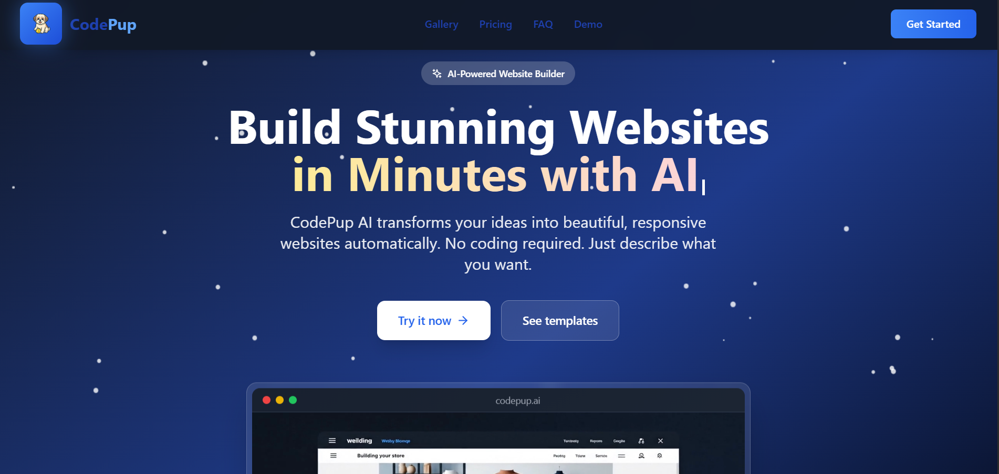
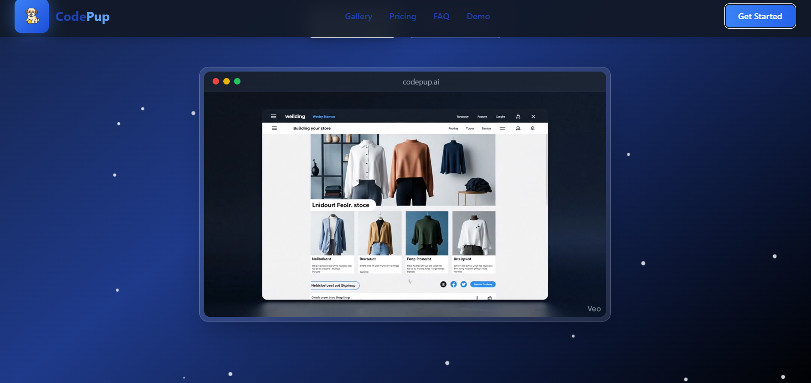
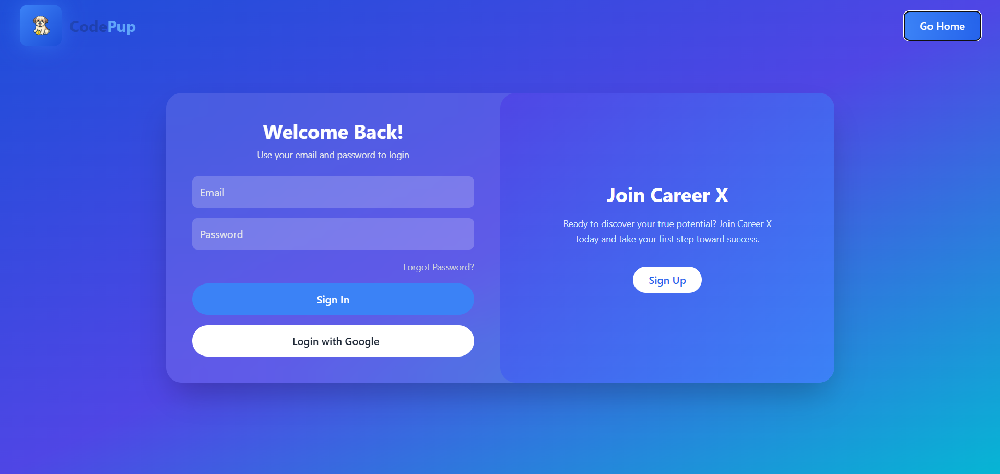
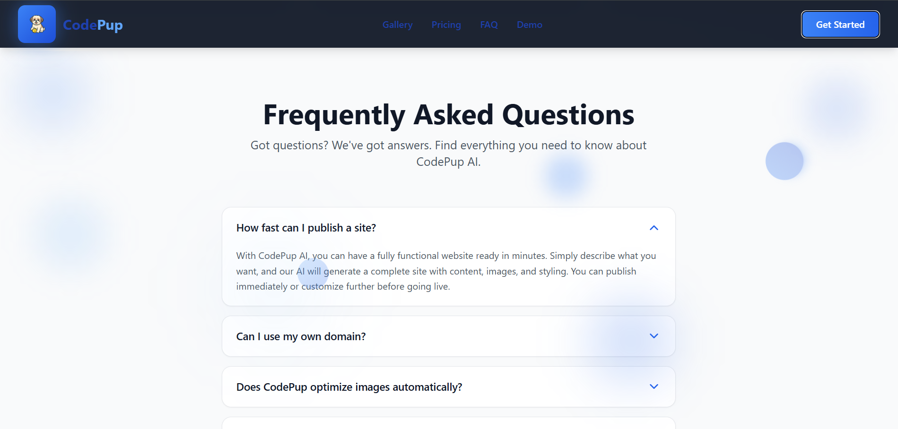

# CodePup AI - Interactive Website Builder



CodePup AI is a modern AI-powered website builder that allows users to create stunning, responsive websites with zero coding. This project demonstrates an interactive frontend using **React**, **TypeScript**, **TailwindCSS**, and **Framer Motion**.

---

## Table of Contents
- [Features](#features)
- [Creative Features](#creative-features)
- [Screenshots](#screenshots)
- [Run Locally](#run-locally)
- [Usage](#usage)
- [Folder Structure](#folder-structure)
- [Components Overview](#components-overview)
- [Contributing](#contributing)
- [License](#license)

---

## Features
- **Interactive Hero Section**
  - Typing animation with gradient text
  - Sparkling badge with AI highlight
  - Particle background following cursor
  - Code editor mockup with hero video

- **Gallery Section**
  - Grid of templates showcasing websites
  - Animated hover effects on cards
  - Modal preview with detailed information
  - Search bar (frontend-only, attractive design)

- **Prompt Page**
  - Interactive prompt input page (frontend-only)
  - Styled input box and submit button
  - Placeholder for AI integration

- **Routing**
  - React Router v6 setup
  - Pages: Home (`/`), Auth (`/auth`), Prompt (`/prompt`)

- **Responsive Design**
  - Fully responsive for desktop, tablet, and mobile
  - TailwindCSS utility classes

---

## Creative Features
- **Animations & Transitions**
  - Smooth fade-in and slide-up animations using Framer Motion
  - Hover scaling and shadow effects on buttons and cards
  - Floating gradient elements in background for 3D feel
  - Blinking cursors and typing animation in hero text

- **Interactive Pages**
  - **Login / Signup Pages**: Minimal, elegant forms with hover effects
  - **Contact Page**: Styled form with input focus animations
  - **Gallery Modal**: Smooth scaling and backdrop blur for previews
  - **Prompt Page**: Interactive prompt input with gradient button hover effect

- **3D & Visual Effects**
  - Particle animation in hero section
  - Gradient overlays on gallery cards
  - Subtle floating elements for depth perception
  - Mockup videos and animated badges

- **UI Enhancements**
  - Search bar with icon and animated focus effect
  - Card hover overlays with gradient fade
  - Buttons with scale and shadow transitions
  - TailwindCSS blur and backdrop effects

---

## Screenshots

### Hero Section


### Gallery Section


### Login / Signup Page


### FAQ Page


### Pricing Page


---

## Run Locally

```bash
1. Clone the repository:
git clone https://github.com/yourusername/codepup-ai.git
cd codepup-ai

2. Install dependencies:
npm install

3. Start the development server:
npm run dev
